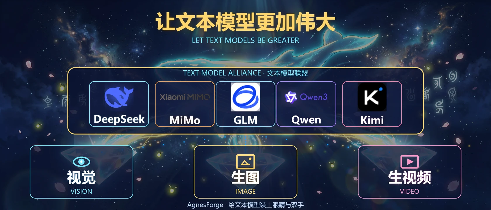

<div align="center">

<p align="center">
  
</p>

# ⚒️ 让文本模型拥有多模态的技能

### One Script. Every AI Agent. **100% FREE** Media Generation.

[](https://python.org)
[](#)
[](https://platform.agnes-ai.com)
[](LICENSE)
[](#free-forever)
[](#free-forever)
[](#free-forever)
[](#auto-retry--model-fallback)

[](#install)
[](#install)
[](#install)
[](#install)
[](#install)
[](#install)
[](#install)

> **✨ 30 seconds to supercharge your AI agent with image generation, video generation & image understanding — 100% free forever, zero dependencies, no credit card.**

**Generate images · Generate videos · Analyze images — from any AI coding agent. Completely FREE.**

</div>

---

## 💯 Free Forever

This skill is **completely free to use — no strings attached**:

- 💰 **$0 forever** — all models are free, no trial period, no credit card required
- 🔓 **No registration friction** — just grab a free API key at [platform.agnes-ai.com](https://platform.agnes-ai.com) → Settings → API Keys
- ♾️ **Unlimited usage** — no usage caps, no hidden quotas (only standard rate limits apply)
- 🛡️ **No data training** — your prompts are not used to train models

> If you can run a Python script, you can generate images, videos, and understand pictures — **for free, on any AI agent you use**.

---

## 🎨 Live Demo

Generated entirely by this skill itself (text → image → video, all free):

### 🖼️ Anime Scene — image + video generation

<p align="center">
  
  <br>
  <em>Image: "Floating island under a glowing cherry blossom tree" — text-to-image with <code>agnes-image-2.1-flash</code></em>
</p>

<p align="center">
  
  <br>
  <em>Video: same scene animated — image-to-video with <code>agnes-video-v2.0</code></em>
</p>

> 🔁 All assets above were generated with **one script, a few commands, zero cost**. Try it yourself in the [Quick Start](#quick-start-30-seconds).

---

## 🚀 Why 让文本模型拥有多模态的技能?

Every AI coding agent (Claude Code, Cursor, Trae, WorkBuddy...) can run Python scripts. But none of them come with built-in media generation. **This skill fills that gap** with a single zero-dependency Python file that gives your AI agent the power to:

| Capability | Primary Model | Backup (auto-fallback) | What You Can Do |
|:---:|:---:|:---:|:---|
| **Image Gen** | `agnes-image-2.1-flash` | `agnes-image-2.0-flash` | Text→Image, Image→Image editing, Multi-image composition |
| **Video Gen** | `agnes-video-v2.0` | — (official only) | Text→Video, Image→Video, Keyframe animation |
| **Vision** | `agnes-2.0-flash` | `agnes-1.5-flash` | Image recognition, OCR, chart analysis, screenshot analysis |

All models are **100% free — forever**. No credit card. No usage limit. See [Free Forever](#free-forever).

**Built-in model fallback:** if a primary model fails, the script automatically retries with the backup model — no user action needed. Response includes a `model_used` field. Use `--model <id>` to force a specific model.

---

## Quick Start (30 seconds)

```bash
# 1. Clone
git clone https://github.com/yourname/agnes-forge.git && cd agnes-forge

# 2. Install for your AI agent (auto-detects)
./install.sh --api-key sk-your-free-key

# 3. That's it. Ask your AI agent:
#    "Generate an image of a sunset over Tokyo"
```

> Get your free API key at [platform.agnes-ai.com](https://platform.agnes-ai.com) → Settings → API Keys → Create

---

## Install

### One-Click Installer

```bash
./install.sh [options]
```

| Option | Description |
|--------|-------------|
| `--platform <name>` | `workbuddy` / `claude` / `cursor` / `trae` / `windsurf` / `copilot` / `opencode` / `all` |
| `--api-key <key>` | Save your Agnes AI API key during install |
| `--dir <path>` | Custom install directory (default: `~/.agnes-forge`) |

Auto-detects your platform if `--platform` is omitted.

> **💡 How deployment works after the rename:** this repo stores platform configs under **plain names** (`trae/`, `cursor/`, `cursorrules`...) so they are visible when uploading via the GitHub web UI. AI agents only read their **standard dot paths** (`.trae/skills/`, `.cursorrules`...). Running `./install.sh` copies the configs into those standard locations automatically — **so deployment = run the installer once**. No manual renaming needed.

### Platform-Specific Setup

<details>
<summary><b>WorkBuddy</b></summary>

```bash
./install.sh --platform workbuddy --api-key sk-xxx
```
Installs to `~/.workbuddy/skills/agnes-forge/` with `SKILL.md`.
</details>

<details>
<summary><b>Claude Code</b></summary>

```bash
./install.sh --platform claude --api-key sk-xxx
```
Creates `CLAUDE.md` and `claude/commands/agnes.md` (slash command) in your project root.
</details>

<details>
<summary><b>Cursor</b></summary>

```bash
./install.sh --platform cursor --api-key sk-xxx
```
Creates `cursorrules` and `cursor/rules/agnes-forge.mdc` in your project root.
</details>

<details>
<summary><b>Trae</b></summary>

Installs **both** a Trae Skill (`trae/skills/agnes-forge/SKILL.md` with YAML frontmatter) and Trae Rules (`trae/rules/agnes-forge.md`):

```bash
./install.sh --platform trae --api-key sk-xxx
```

- **Project-level:** `trae/skills/agnes-forge/` + `trae/rules/agnes-forge.md` (in this repo)
- **Global-level:** `~/.trae/skills/agnes-forge/` (macOS/Linux) or `%USERPROFILE%\.trae\skills\agnes-forge\` (Windows, Trae standard location)

The Trae skill is self-contained (SKILL.md + scripts + references) and can be zipped/uploaded directly to TRAE SOLO via 技能 → 上传技能.
</details>

<details>
<summary><b>Windsurf</b></summary>

```bash
./install.sh --platform windsurf --api-key sk-xxx
```
Creates `windsurfrules` in your project root.
</details>

<details>
<summary><b>GitHub Copilot</b></summary>

```bash
./install.sh --platform copilot --api-key sk-xxx
```
Creates `github/copilot-instructions.md` in your project root.
</details>

<details>
<summary><b>OpenAI Codex CLI</b></summary>

Codex CLI reads `AGENTS.md` — the universal instruction file already included in this repo.

```bash
# Install the universal instructions + core tool
./install.sh --platform opencode --api-key sk-xxx

# Or just copy AGENTS.md into your Codex project
cp AGENTS.md /path/to/your/codex-project/
```
</details>

<details>
<summary><b>OpenCode / Generic</b></summary>

```bash
./install.sh --platform opencode --api-key sk-xxx
```
Creates `AGENTS.md` (universal agent instructions) in your project root.
</details>

<details>
<summary><b>All Platforms</b></summary>

```bash
./install.sh --platform all --api-key sk-xxx
```
Installs config files for every supported platform at once.
</details>

---

## Usage

### Generate Image (Text → Image)

```bash
python scripts/agnes_api.py image \
  --prompt "A golden retriever puppy under cherry blossoms, watercolor style, soft morning light" \
  --size 2K --ratio 1:1 --download
```

### Edit Image (Image → Image)

```bash
python scripts/agnes_api.py image-edit \
  --prompt "Transform into an oil painting" \
  --image photo.jpg --download
```

### Generate Video (official `agnes-video-v2.0`)

Strictly follows the official docs: [agnes-video-v20](https://www.agnes-ai.com/zh-Hans/docs/agnes-video-v20)

```bash
# Text → Video
python scripts/agnes_api.py video \
  --prompt "A cat walking on a sunny beach, golden hour, tracking shot" \
  --mode text --seconds 5 --aspect-ratio 16:9 --wait --download

# Image → Video (official `image` field)
python scripts/agnes_api.py video \
  --prompt "Animate the waves gently" \
  --mode text --images photo.jpg --wait --download

# Keyframe animation (official extra_body.image + mode="keyframes")
python scripts/agnes_api.py video \
  --prompt "Smooth transition from day to night" \
  --mode keyframe --first-frame day.jpg --last-frame night.jpg --wait --download
```

### Analyze Image

```bash
python scripts/agnes_api.py vision \
  --prompt "Extract all text from this screenshot and format as markdown" \
  --image screenshot.png --thinking
```

> **💡 Text-only model can't see pasted images?** If your AI agent says it cannot view an image you pasted into chat, just give it the image's **local path** (e.g. `C:\Users\you\Desktop\photo.png`) or a **public URL** (e.g. `https://example.com/photo.png`) instead — it will analyze the image via `vision --image <path-or-url>` (also works for `image-edit` and `video --images`).

### Save API Key

```bash
python scripts/agnes_api.py set-key sk-your-api-key
```
Saved to `scripts/.env`. All commands auto-read it. Never pass it again.

---

## Command Reference

| Command | Description | Key Options |
|---------|-------------|-------------|
| `set-key` | Save API key to .env | `api_key` (positional) |
| `image` | Text → Image generation | `--prompt`, `--size`, `--ratio`, `--download` |
| `image-edit` | Image → Image editing | `--prompt`, `--image`, `--format`, `--download` |
| `video` | Video generation (official v2.0) | `--prompt`, `--mode`, `--seconds`, `--aspect-ratio`, `--wait`, `--download` |
| `video-status` | Query video task status | `--video-id`, `--download` |
| `vision` | Image recognition / analysis | `--prompt`, `--image`, `--model`, `--thinking` |

<details>
<summary><b>All Options</b></summary>

#### `image`
| Option | Type | Description | Default |
|--------|------|-------------|---------|
| `--prompt, -p` | string | Image description (required) | — |
| `--size, -s` | string | `1K`/`2K`/`3K`/`4K` or `WxH` | `1024x1024` |
| `--ratio, -r` | string | `1:1`/`16:9`/`9:16`/`4:3`/`3:4`/`2:3`/`3:2`/`21:9` | — |
| `--return-base64` | flag | Return base64 instead of URL | false |
| `--download, -d` | flag | Download to your Desktop | false |

#### `image-edit`
| Option | Type | Description | Default |
|--------|------|-------------|---------|
| `--prompt, -p` | string | Edit instruction (required) | — |
| `--image, -i` | string | Input image(s), URL or local path, comma-separated (required) | — |
| `--size, -s` | string | Output size | `1024x1024` |
| `--format, -f` | string | `url` or `b64_json` | `url` |
| `--download, -d` | flag | Download result | false |

#### `video`
| Option | Type | Description | Default |
|--------|------|-------------|---------|
| `--prompt, -p` | string | Video description (required) | — |
| `--mode` | string | `text` / `keyframe` | `text` |
| `--seconds` | int | Target duration → `num_frames` (8n+1 rule, max ~18s) | `5` |
| `--aspect-ratio` | string | `16:9`/`9:16`/`1:1`/`4:3`/`3:4`/`21:9` → width/height | `1152x768` |
| `--seed` | int | Random seed | — |
| `--negative-prompt` | string | What to avoid in the video | — |
| `--first-frame` | string | First frame image URL (keyframe mode) | — |
| `--last-frame` | string | Last frame image URL (keyframe mode) | — |
| `--images` | string | Image URL for image-to-video (text mode) | — |
| `--wait, -w` | flag | Auto-poll until complete | false |
| `--download, -d` | flag | Download video when done | false |

#### `vision`
| Option | Type | Description | Default |
|--------|------|-------------|---------|
| `--prompt, -p` | string | Question or instruction (required) | — |
| `--image, -i` | string | Image(s), URL or local path, comma-separated (required) | — |
| `--model, -m` | string | `agnes-2.0-flash` or `agnes-1.5-flash` | `agnes-2.0-flash` |
| `--system, -s` | string | System prompt | — |
| `--temperature` | float | Sampling temperature | — |
| `--max-tokens` | int | Max output tokens | — |
| `--thinking` | flag | Enable deep reasoning mode | false |

</details>

---

## Features

- **Zero Dependencies** — Pure Python standard library. No `pip install`. No virtualenv. Just run.
- **One Script, All Agents** — Same `agnes_api.py` works with Claude Code, Cursor, Trae, WorkBuddy, Windsurf, Copilot, OpenCode.
- **Auto-Retry (5x) + Model Fallback** — Exponential backoff (2s→5s→10s→20s→30s) on 429/500/503/network errors. If a model fails, auto-switches to the backup free model. Never silently fail.
- **Local File Support** — Auto-converts local images to base64. No upload to external services.
- **Auto-Download** — Generated images and videos save to your **Desktop** by default (override with `AGNES_OUTPUT_DIR`).
- **Video Polling** — `--wait` flag auto-polls async video tasks until completion (1-3 min).
- **Thinking Mode** — Enable deep reasoning for complex image analysis.
- **API Key Management** — `set-key` command saves to `.env`. All commands auto-read.
- **OpenAI Compatible** — Agnes AI API is OpenAI v1 compatible. Drop-in replacement.

---

## How It Works

```
┌─────────────────────────────────────────────────────────┐
│  Your AI Agent (Claude / Cursor / Trae / WorkBuddy...) │
│  Reads: CLAUDE.md / cursorrules / AGENTS.md / SKILL.md│
└──────────────────────┬──────────────────────────────────┘
                       │  executes
                       ▼
              ┌─────────────────┐
              │  agnes_api.py    │  ← Zero-dep Python CLI
              │  (611 lines)     │
              └────────┬────────┘
                       │  HTTP (auto-retry 5x)
                       ▼
           ┌───────────────────────┐
           │   Agnes AI API (v1)    │  ← Free during beta
           │  apihub.agnes-ai.com   │
           └───────────┬───────────┘
                       │
          ┌────────────┼────────────┐
          ▼            ▼            ▼
    ┌──────────┐ ┌──────────┐ ┌──────────┐
    │  Image   │ │  Video   │ │  Vision  │
    │  2.1     │ │  v2.0    │ │  2.0     │
    │  flash   │ │          │ │  flash   │
    └──────────┘ └──────────┘ └──────────┘
```

---

## Project Structure

```
agnes-forge/
├── install.sh                        # One-click cross-platform installer
├── AGENTS.md                         # Universal instructions (OpenCode, generic)
├── CLAUDE.md                         # Claude Code instructions
├── SKILL.md                          # WorkBuddy skill definition
├── cursorrules                      # Cursor rules
├── cursor/rules/agnes-forge.mdc     # Cursor rules (new format)
├── claude/commands/agnes.md         # Claude Code slash command
├── trae/rules/agnes-forge.md        # Trae rules
├── trae/skills/agnes-forge/         # Trae skill (SKILL.md + scripts + references)
│   ├── SKILL.md                      #   YAML frontmatter (name + description)
│   ├── scripts/agnes_api.py
│   └── references/api-reference.md
├── windsurfrules                    # Windsurf rules
├── github/copilot-instructions.md   # GitHub Copilot instructions
├── docs/
│   ├── agnes-forge-banner.webp       # Project banner (generated by 让文本模型拥有多模态的技能)
│   └── demo/
│       ├── demo-image.webp           # Demo: text-to-image sample
│       ├── demo-video.mp4            # Demo: image-to-video sample
├── scripts/
│   ├── agnes_api.py                  # Core CLI tool (611 lines, zero deps)
│   └── .env                          # API key (gitignored)
├── references/
│   └── api-reference.md              # Full API documentation
├── LICENSE                           # MIT
├── .gitignore
└── README.md                         # You are here
```

---

## Prompt Tips

### Image Generation
```
[Subject] + [Scene/Background] + [Style] + [Lighting] + [Composition] + [Quality]
```
> *"A golden retriever puppy under cherry blossom trees, watercolor painting style, soft morning light, close-up portrait, ultra-detailed"*

### Video Generation
Official prompt structure: `[Subject] + [Action] + [Scene] + [Camera movement] + [Lighting] + [Style]`. Be specific about motion and camera.

> *"A cat slowly walks along a sunny beach, gentle waves lapping at its paws, warm golden hour light, camera tracking shot from behind"*

For image-to-video: describe what should move and what stays consistent. For keyframes: describe the transition between frames.

### Image Analysis
Be specific about what you want extracted. Use `--thinking` for complex reasoning tasks.

> *"Extract all text from this screenshot, format as a markdown table with columns: Field, Value"*

---

## Auto-Retry & Model Fallback

**Layer 1 — Request retry (same model):**

| Error | Retry? | Backoff |
|-------|:------:|---------|
| 401 Auth failed | No | Fail immediately |
| 400 Bad request (non-model) | No | Fail immediately |
| 429 Rate limited | Yes | 2s → 5s → 10s → 20s → 30s |
| 500 Server error | Yes | 2s → 5s → 10s → 20s → 30s |
| 503 Service busy | Yes | 2s → 5s → 10s → 20s → 30s |
| Network timeout | Yes | 2s → 5s → 10s → 20s → 30s |

Only after **5 consecutive failures** does the tool give up on the current model.

**Layer 2 — Model fallback (switch to backup free model):**

| Capability | Primary → Backup | Notes |
|:---:|:---:|:---|
| Image | `agnes-image-2.1-flash` → `agnes-image-2.0-flash` | Same params |
| Video | `agnes-video-v2.0` (official) | v2.5 deprecated — no official docs, failed in practice |
| Vision | `agnes-2.0-flash` → `agnes-1.5-flash` | Thinking auto-disabled on 1.5 |

Only when **all** models fail does the tool report an error. Response JSON includes `model_used`; use `--model <id>` to force a specific model.

---

## API Reference

Full API documentation: [`references/api-reference.md`](references/api-reference.md)

| Item | Value |
|------|-------|
| Base URL | `https://apihub.agnes-ai.com/v1` |
| Auth | `Authorization: Bearer YOUR_API_KEY` |
| Protocol | OpenAI v1 compatible |
| Get API Key | [platform.agnes-ai.com](https://platform.agnes-ai.com) |
| Pricing | **FREE** during beta |

---

## Contributing

1. Fork this repo
2. Create your feature branch (`git checkout -b feature/amazing-feature`)
3. Commit your changes (`git commit -m 'Add amazing feature'`)
4. Push to the branch (`git push origin feature/amazing-feature`)
5. Open a Pull Request

---

## License

[MIT](LICENSE) — feel free to use, modify, and distribute.

---

## Star History

If this skill saved you time, give it a star!

---

<div align="center">

**Made with Agnes AI · Zero dependencies · Works everywhere**

</div>
